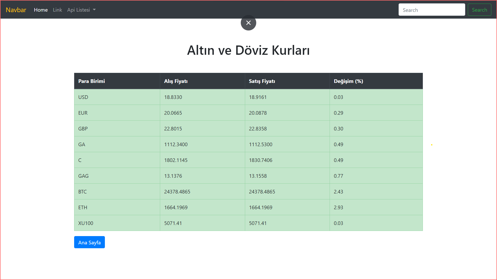

# Ruby On Rails İle Api 

 


### Projede; Ruby On Rails ile api çalışması mevcut 

---



Bu repo [Rails](https://rubyonrails.org/) kişisel  Back-End Eğitiminde oluşturduğum bootstrap ile şekillendirdiğim api çalışmalarım mevcut.

## Installation

Öncelikle projeyi clonelayın.

```
https://github.com/mucahidcanbey/railsApi.git
```

## Usage
Projeyi cloneladıktan sonra Visual Studio Code programında açınız.

Linux için:
```
cd railsApi
code .
```
## Contributing
Pull requestler kabul edilir. Büyük değişiklikler için, lütfen önce neyi değiştirmek istediğinizi tartışmak için bir konu açınız.

## License
[MIT](https://choosealicense.com/licenses/mit/)

